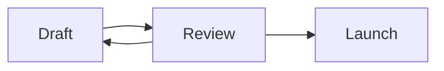
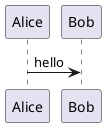

Diagrams are fenced code blocks with a language tag — standard Markdown, rendered in place. The text stays the canonical form; the picture is derived from it.

## Mermaid

````md

````


Mermaid renders directly in the editor — flowcharts, sequence diagrams, state machines and the rest of the Mermaid language. The block renders as a diagram; putting the caret on it (or pressing <kbd>Ctrl</kbd>+<kbd>Enter</kbd>) opens the source for editing, with the rendering updating as you type.

## PlantUML

````md

````

**By default a PlantUML block shows its source.** When your deployment has a render service configured, the same block renders as a diagram — ask your operator, or see `PLANTUML_RENDER_URL` in the [environment reference](/reference/environment-variables/). The text in the page is the same either way, so documents move between deployments without edits.

## Why fences?

A diagram-as-code-fence is portable: any Markdown tool shows at least the source, GitHub renders Mermaid natively, and exports carry the block verbatim. You are never locked into Wikistead to read your own diagrams.

For freehand drawing (boxes and arrows with a mouse), see [Drawings](/editor/drawings/).
