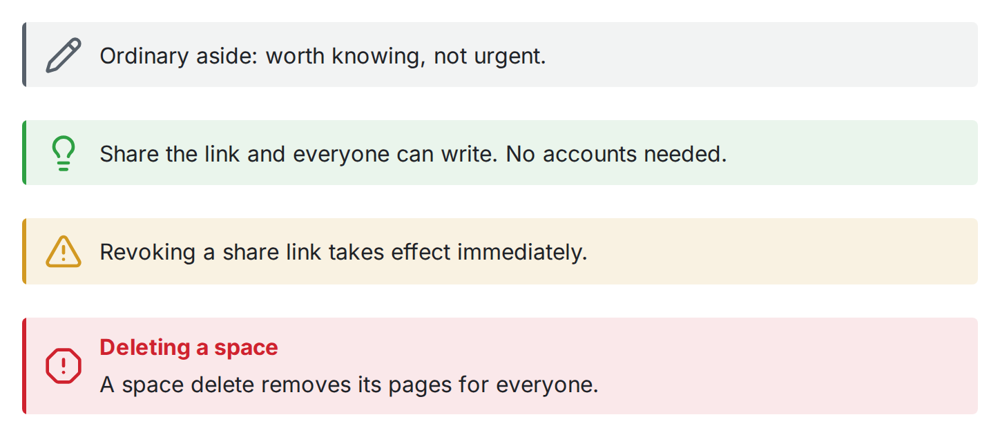

この章はエディタのマクロ（`:::` ディレクティブとコードフェンス）を扱います。見出しやリンク、ハイライト、脚注、数式など、素の Markdown の記法は[Markdown 記法](/ja/reference/markdown-notation/)を参照してください。

コールアウトは、読み飛ばしてほしくない文章を、アイコンの付いた色付きのパネルで囲む機能です。種類は 5 つあり、種類ごとにディレクティブが分かれています。

```md
:::note
中立的な補足。
:::

:::info
読者が知りたいかもしれない背景。
:::

:::tip
知っておくと得する近道。
:::

:::warning
うまくいかない可能性のあること。
:::

:::danger
破壊的・不可逆なこと。
:::
```




## ラベル

どの種類でも、1 行目の角括弧に書いた文字列が見出しになります。

```md
:::warning[移行の前に]
先にバックアップをエクスポートしてください。移行するとすべてのページ id が書き換わります。
:::
```

## 本文は Markdown のまま

コールアウトの中身はふつうの Markdown です。リストもリンクもコードフェンスも、他のマクロも、そのまま中で描画されます。エディタではパネルがページ上に表示され、カーソルを中に置くと `:::` の行が現れるので、生の形もいつでも編集できます。

## 補足

- 種類の指定では大文字と小文字を区別しません（`:::WARNING` と `:::warning` は同じです）。
- 知らない種類（`:::something`）を書いてもエラーにはならず、`note` として描画されます。Obsidian と同じ扱いです。
- エクスポートした Markdown には `:::` のディレクティブがそのまま残ります。`:::` は広く使われている書き方ですし、中身はもともと標準の Markdown だからです。
