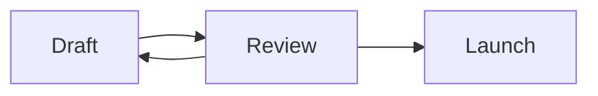
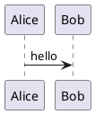

図は言語タグ付きのコードフェンスです——標準 Markdown のまま、その場で描画されます。正典はテキストで、絵はそこから導出されます。

## Mermaid

````md

````

Mermaid はエディタ内で直接描画されます——フローチャート・シーケンス図・状態遷移図など、Mermaid 言語の一通りが使えます。ブロックは図として描画され、キャレットを載せる（または <kbd>Ctrl</kbd>+<kbd>Enter</kbd>）とソースが開き、入力に合わせて描画が更新されます。

## PlantUML

````md

````

PlantUML は設計上、扱いが異なります。レンダラを同梱できない（GPL で、Java ランタイムが要る）ため、**既定ではブロックはソースを表示**します——常に正しい Markdown で、外部依存はありません。運用者がデプロイに外部レンダーサービス（Kroki または PlantUML サーバ）を設定すると、同じブロックが図として描画されます。どちらの場合もページ内のテキストは同一なので、ドキュメントは編集なしでデプロイ間を移動できます。

## なぜフェンスなのか

コードフェンスとしての図は可搬です：どの Markdown ツールでも最低限ソースは見え、GitHub は Mermaid をネイティブに描画し、エクスポートはブロックをそのまま運びます。自分の図を読むために Wikistead に閉じ込められることはありません。

マウスで描くフリーハンドの図は[ドローイング](/ja/editor/drawings/)へ。
