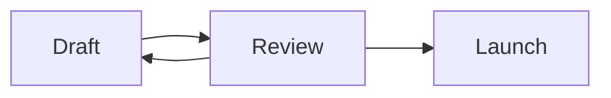
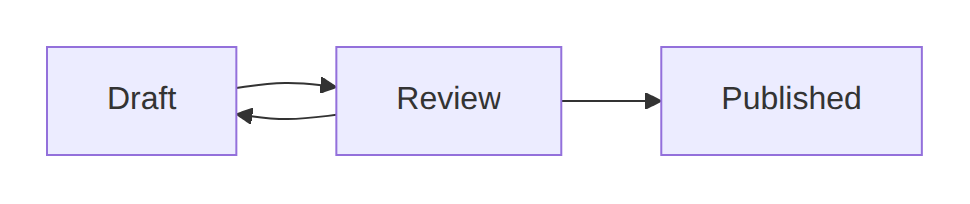
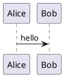

図は、言語タグを付けたコードフェンスとして書きます。標準の Markdown のまま、ページ上で描画されます。元になるのはあくまでテキストで、図はそこから描かれます。

## Mermaid

````md

````



Mermaid はエディタの中でそのまま図になります。フローチャート、シーケンス図、状態遷移図など、Mermaid で書けるものが一通り使えます。カーソルを置くか <kbd>Ctrl</kbd>+<kbd>Enter</kbd> を押すとソースが開き、入力に合わせて図が更新されます。

## PlantUML

````md

````

PlantUML は扱いが少し違います。描画エンジンを同梱できない（GPL であり、Java の実行環境も必要になる）ため、**既定ではブロックにソースが表示されます**。その状態でもページは Markdown として正しく、外部サービスにも依存しません。サーバーを運用する人が外部の描画サービス（Kroki または PlantUML サーバー）を設定すると、同じブロックが図として描画されます。どちらの場合もページに書かれているテキストは同じなので、ドキュメントを書き換えずに別の環境へ持っていけます。

## コードフェンスで書く理由

コードフェンスで書いた図は持ち運べます。どの Markdown ツールでも少なくともソースは読めますし、GitHub は Mermaid をそのまま描画します。エクスポートしてもブロックはそのまま残ります。自分が書いた図を読むのに Wikistead は要りません。

マウスで自由に描く図については[ドローイング](/ja/editor/drawings/)を参照してください。
