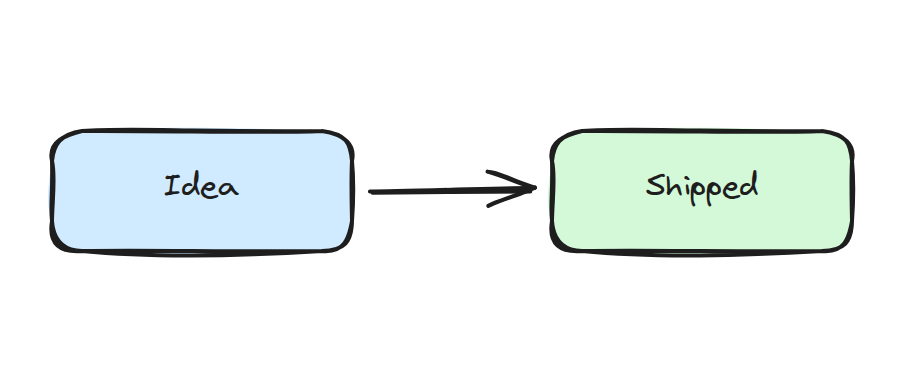

手描きのスケッチ、ホワイトボード風の図、四角と矢印だけの簡単な構成図を描きたいときは、[Excalidraw](https://excalidraw.com/) のキャンバスをフェンスブロックとして埋め込めます。

````md
```excalidraw
```
````



このブロックを手で書く必要はありません。エディタのマクロパレットからドローイングを挿入し、<kbd>Ctrl</kbd>+<kbd>Enter</kbd>（またはブロックの編集ボタン）を押すと、Excalidraw のキャンバスが画面に重なる編集ウィンドウで開きます。図形、矢印、フリーハンド、テキストなど、ひととおりの道具が使えます。ウィンドウを閉じると、図はページ上にそのまま表示されます。

## 何が保存されるか

フェンスの本文は図のシーンデータ、つまり Excalidraw が使っている JSON そのものです。そのため次のようになります。

- ページはプレーンテキストの Markdown 1 枚のままです。図はフェンスの中のデータであって、バイナリの添付ファイルではありません。
- 描いた内容は持ち運べます。同じ JSON を Excalidraw 本家のアプリでもそのまま開けます。
- 図の変更も、他のテキスト編集と同じように版の履歴に残り、共同編集の対象になります。

## 図の共同編集

編集ウィンドウが開いている間、編集はリアルタイムで共有されます。2 人が同じキャンバスを同時に編集でき、ウィンドウを閉じるとその結果がページに書き戻されます。

## テーマ

既定の色で描いた線は、読む人のライト / ダークのテーマに合わせて表示されます。ダークテーマで描いた図が、ライトテーマの画面で見えなくなることはありません。自分で色を選んだ部分は、選んだ色のまま表示されます。
