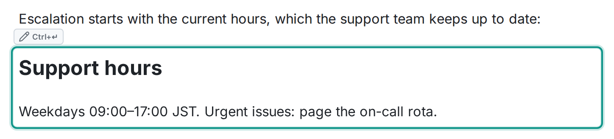

別の場所にある内容をページに取り込むディレクティブが 2 つあります。`:::embed-page` は**他の Wikistead ページ**を、`:::embed-external` は**許可リストに載っている外部の URL** を埋め込みます。どちらもマクロパレットから選んで挿入します。生の記法があるのは、書き出したときに内容が残るようにするためで、手で打つことは想定していません。

## ページを埋め込む

```md
:::embed-page
<pageId>
:::
```




指定したページの内容が、このページの中に表示されます。表示は常に最新で、元のページを編集すれば埋め込み先すべてに反映されます。知っておきたい点が 2 つあります。

- **権限は読む人ごとに確認されます。** 埋め込んでもアクセス権は広がりません。埋め込み先のページが見えている人でも、埋め込まれたページを見る権限がなければ、その場所には何も表示されません。
- **保存されるのは参照だけです。** ドキュメントに書かれるのは「どのページを埋め込むか」だけで、エクスポートすると内容をコピーするのではなくリンクになります。

マクロパレットの**ページを埋め込む**から挿入して、対象のページを選びます。埋め込むページは <kbd>Ctrl</kbd>+<kbd>Enter</kbd> でいつでも選び直せます。

## 外部 URL の埋め込み

```md
:::embed-external
https://example.com/dashboard
:::
```

外部の埋め込みは**サンドボックス化した iframe** として表示されます。対象になるのは、管理者が許可リスト（**管理 → 外部埋め込み**）に載せたホストだけです。リストにないホストの URL は、ただのリンクとして表示されます。表示できない空の領域が残ったり、訪問者を追跡する iframe が動いたりすることはありません。

この線引きは意図的なものです。埋め込みは、Wikistead をダッシュボードや動画、デザインツールと組み合わせるための機能です。許可リストは、そのうちどの外部サービスをページの中で動かすかを管理者が決めるためのものです。

## エクスポートしたときの扱い

どちらの埋め込みも、Markdown や HTML に書き出すと**リンクになります**。本体が別の場所にある内容を書き出すなら、これがいちばん実態に合った形だからです。書き出したファイルに、表示できない領域や、外部サイトを動かす仕掛けが残ることはありません。
