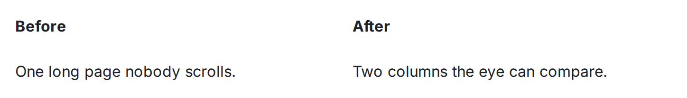
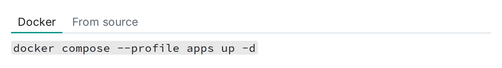
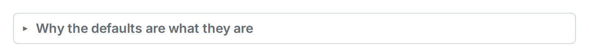

Markdown に書けることを増やすのではなく、書いたものを並べるためのディレクティブが 3 つあります。**カラム**（`:::columns`・横並び）、**タブ**（`:::tabs`）、**折りたたみ**（`:::details`）です。中身はふつうの Markdown なので、ページの他の場所で描画されるものは、この中でも同じように描画されます。

## カラム

```md
:::columns
:::column
左側。リストもテーブルも画像も置けます。
:::
:::column
右側。
:::
:::
```


画面が広いときは、中身が横に並びます。編集中もカラムの並びは保たれます。カラムをクリックすればページ上でそのまま中身を編集でき、カラムごとのボタンで追加や削除ができます。



## タブ

```md
:::tabs
:::tab[macOS]
macOS の手順。
:::
:::tab[Windows]
Windows の手順。
:::
:::
```

`:::tab[ラベル]` の 1 つ 1 つがタブになり、読む人が自分で切り替えられます。OS ごとの手順や、一度に片方だけ見せたい比較に向いています。



## 折りたたみ（details）

```md
:::details[移行が触るもの]
既定では畳まれている長い答え。
:::
```

ラベルが見出しになり、中身を折りたたんでおけます。本文に書くには長すぎる補足を入れておく場所です。



## 編集のしかた

これらのマクロは**ページ上でそのまま**編集します。中の枠をクリックすると、その枠の Markdown を編集できる欄が開きます。生の `:::` の形はソースモードでいつでも確認できますし、エクスポートで書き出されるのもこの形です。Wikistead を使っていない人がそのファイルを開いても、中身が上から順に読めます。
