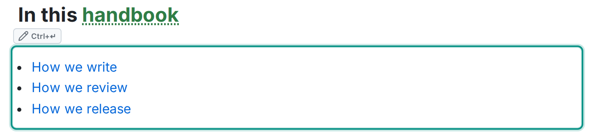

`:::children` を置くと、**そのページの直下にある子ページ**の一覧が自動で表示されます。索引のページやまとめのページに置いておけば、内容が古くなることがありません。

```md
:::children
:::
```




本文は空のままにします。設定する項目はありません。子ページを作ったり移動したりすれば一覧もそのとおりに変わり、削除すれば一覧から消えます。

## 動作の決まり

- **表示のためだけのものです。** 一覧はページを表示するときに作られ、ドキュメントには書き込まれません。Markdown に残るのは上の 2 行だけです。
- **一覧は読む人の権限で絞り込まれます。** 項目ごとにアクセス権を確認し、見る権限のない子ページは一覧にも件数にも出てきません。
- **公開ページや共有リンクから見ている匿名の読者には、公開した時点の一覧が表示されます。**

## 関連

- タグの付いたページを一覧したいとき（子ページに限らず、スペースをまたいで集めたいとき）は[タグ](/ja/editor/tags/)を参照してください。
- このページにリンクしているページを見たいときは、マクロではなく、ページの**関連**パネルにある「リンク元」を開いてください。
