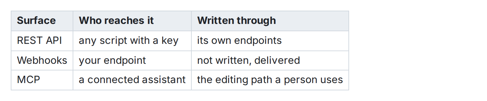

Wikistead のテーブルには 2 つの形があり、必要に応じて自動で切り替わります。単純なテーブルには標準の **GFM のパイプテーブル**を使い、セルの結合やパイプテーブルでは書けない配置が必要になった時点で **`:::table` マクロ**（中身が HTML のテーブル）に変わります。

## パイプテーブル（既定）

```md
| 領域          | 担当 | 状態 |
| ------------- | ---- | ---- |
| アナウンス     | Mia  | 完了 |
| デモ          | Rin  | 下書き |
```




パイプテーブルはページ上でそのままテーブルとして描画され、マウスで編集できます。セルをクリックして入力し、テーブルのボタンで行や列を追加・削除します。編集は操作するたびに保存されるので、一緒に編集している人にはすぐ反映されます。

## 結合や配置が要るとき（`:::table`）

セルを結合したり、既定以外の配置を指定したりすると、テーブルは自動的に `:::table` の形に変わります。中身はふつうの HTML のテーブルです。

```md
:::table
<table>
  <thead>
    <tr><th>四半期</th><th colspan="2">目標</th></tr>
  </thead>
  <tbody>
    <tr><td>Q1</td><td>エディタを出す</td><td>ドキュメントを出す</td></tr>
  </tbody>
</table>
:::
```

`rowspan` や `colspan`、配置はこの形で保持されます。マウスでの編集も同じように使えます。HTML を手で書く必要はほとんどありませんが、必要になれば読める形でそのまま確認できます。

## 標準の形への自動復帰

この切り替えは、戻る方向にも働きます。後から結合や配置を外せば、テーブルは**素のパイプテーブルに戻ります**。ドキュメントは常に、その内容を表現できるいちばん標準的な Markdown の形で保存されます。一度 `:::table` になったら元に戻せない、ということはありません。

## 補足

- セルには改行を含むテキストを書けます。表示するときはテキストとして組み立て直すので、貼り付けた HTML がそのまま実行されることはありません。悪意のあるマークアップをセルに貼り付けても、ページ上でスクリプトは動きません。
- エクスポートしてもテーブルはそのまま残ります。パイプテーブルは GFM のまま、`:::table` は HTML の中身ごと書き出されます。
