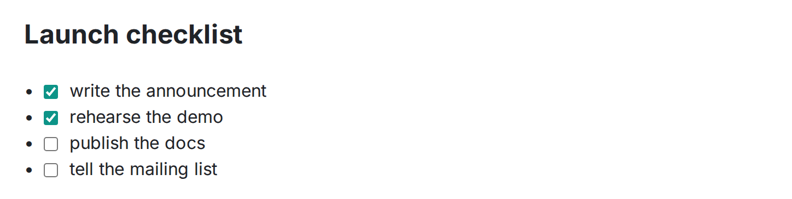

タスクリストは標準の GFM です。そのうえでチェックボックスは**そのままクリックできます**。編集権限のある読者がチェックすると、元の Markdown が `- [ ]` と `- [x]` の間で切り替わり、一緒に編集している全員にリアルタイムで伝わります。

```md
- [x] アナウンスを書く
- [x] デモをリハーサルする
- [ ] スクリーンショットを撮る
- [ ] 出荷する
```




## 進捗リングを付ける（`:::todo`）

タスクリストを `:::todo` で囲むと、**進捗リング**（完了数 / 全体数）の付いたパネルになります。ラベルも付けられます。

```md
:::todo[ローンチのチェックリスト]
- [x] アナウンスを書く
- [ ] 出荷する
:::
```

中身は GFM のタスクリストそのものなので、チェックボックスは同じようにクリックできて、そこに件数の表示が加わります。ページのヘッダーにも全体の完了数と総数が表示されるので、チェックリストのページは開いた瞬間に進み具合が分かります。

## タスク管理ツールではなく、知識のためのもの

Wikistead のタスクは意図的に「ただの Markdown」です。担当者も期限もボードもありません。運用手順書やローンチのページ、議事録など、文章の中に置くチェックリストのための機能です。素の GFM なのでどこにでもエクスポートでき、他のツールでも同じ意味で読めます。本格的なプロジェクト管理は、ページをタスク管理ツールにするのではなく、[外部のツールと組み合わせる](/ja/editor/embeds/)方法をおすすめします。
